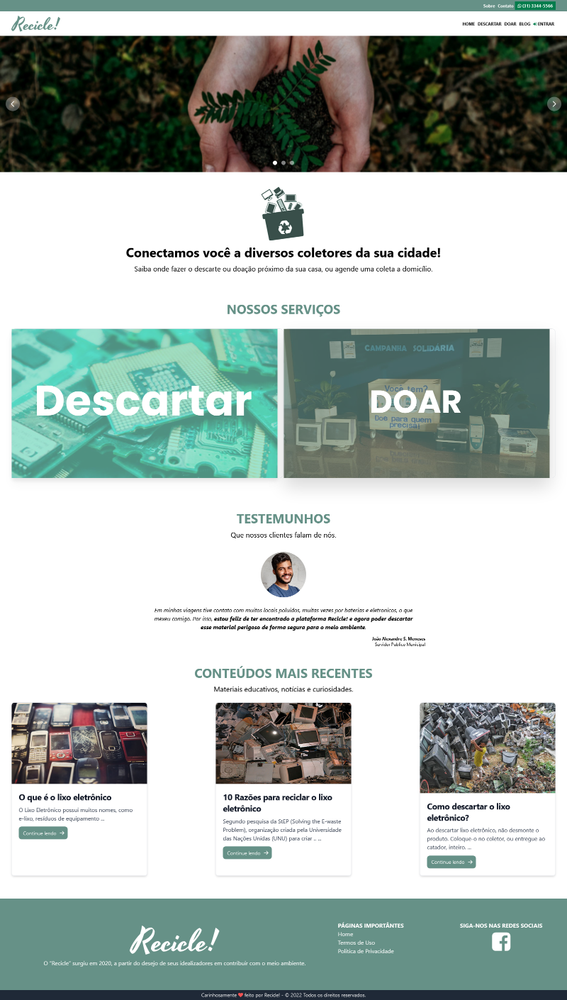

# Recicle!

Este é o repositório principal do Projeto Integrador IV, do Curso de **Análise e Desenvolvimento de Sistemas** do **Centro Universitário Newton Paiva**, aplicativo **_Recicle!_**.

## Heroku

Este projeto pode ser acessado no momento pelo seginte endereço: https://projetorecicle.herokuapp.com/

## Grupo composto por:

- Adelvan Lima
- Ana Santos
- Felipe Carvalho
- Guilherme Neto
- Pâmela Reis